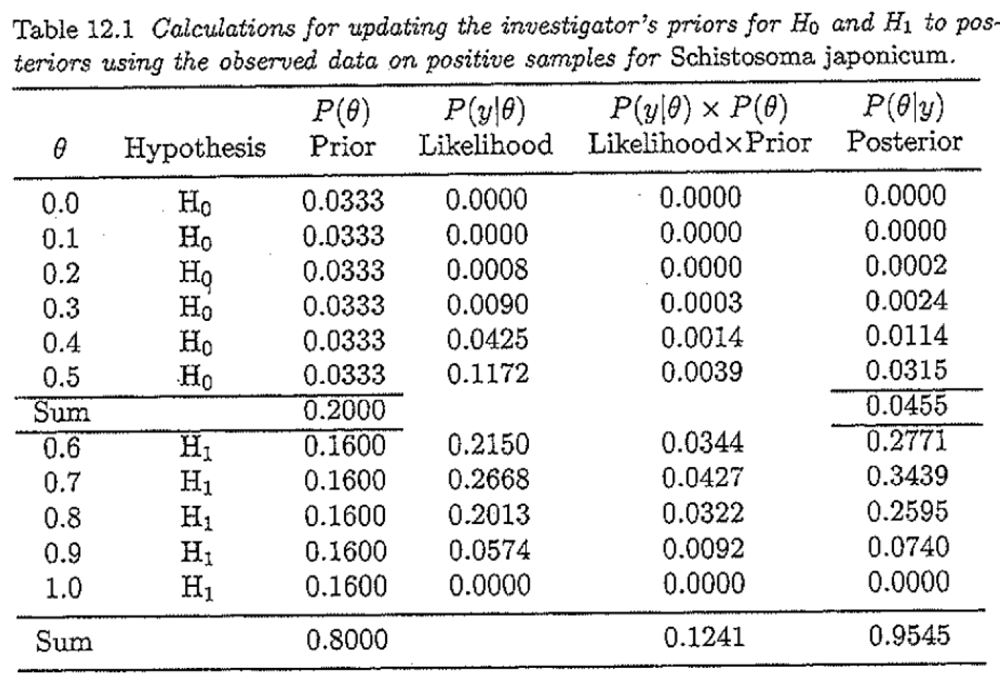

```{r setup, include=FALSE}
knitr::opts_chunk$set(echo = TRUE)
library(knitr)
library(graphics)
library(HDInterval) ## To calculate highest posterior density (HPD) interval
```

## Testing hypothesis
An investigator arrives at a village and after observing the villagers' contact with water, she is 80% sure that infection will be endemic in this village. The investigator takes stool samples from 10 villagers and 7 are positive for the parasite.

H0: Infection is not endemic ($\theta \le 0.5$)

H1: Infection is endemic ($\theta > 0.5$)

{width=60%} 

```{r}
f.table12.1 <- function(theta.cut, prior.H1, bysize, tab=T) {
  theta <- seq(0, 1, by=bysize)
  H1.theta <- ifelse(theta > theta.cut,1,0)   ## H1
  
  theta.prior <- ifelse(H1.theta==1, 
                        prior.H1/length(H1.theta[H1.theta==1]),
                        (1-prior.H1)/length(H1.theta[H1.theta==0]))
  lik <- dbinom(x=7, size=10, prob=theta)
  lik.theta.prior <- lik*theta.prior
  theta.post <- lik.theta.prior/sum(lik.theta.prior)
  
  out <- cbind(theta=theta, H1=H1.theta, theta.prior=theta.prior, lik=lik,
               lik.theta.prior=lik.theta.prior, theta.post=theta.post)
  
  if(tab==T) {
    return(list(tab12.1=round(out, 4),
                H.prior=tapply(theta.prior, H1.theta, sum),
                H.post=tapply(theta.post, H1.theta, sum)))
  } else {
    return(list(H.prior=tapply(theta.prior, H1.theta, sum),
                H.post=tapply(theta.post, H1.theta, sum),
                Equal.tail.interval=
                  c( max(theta[cumsum(theta.post)<=0.05/2]), min(theta[cumsum(theta.post)>1-0.05/2])),
                theta=theta,
                theta.post=theta.post))
  }
}

test1 <- f.table12.1(theta.cut=0.5, prior.H1=0.8, bysize=0.1, tab=T)
test1
test1$H.prior
test1$H.post
BF1 <- (test1$H.post[2]/test1$H.post[1])/(test1$H.prior[2]/test1$H.prior[1])  
BF1

test2 <- f.table12.1(theta.cut=0.5, prior.H1=0.5, bysize=0.0001, tab=F)
test2$H.prior
test2$H.post
BF2 <- (test2$H.post[2]/test2$H.post[1])/(test2$H.prior[2]/test2$H.prior[1])  
BF2

#### Frequentist test
prop.test(x=7, n=10, p=0.5, alternative=c("greater"), correct=FALSE)
```


