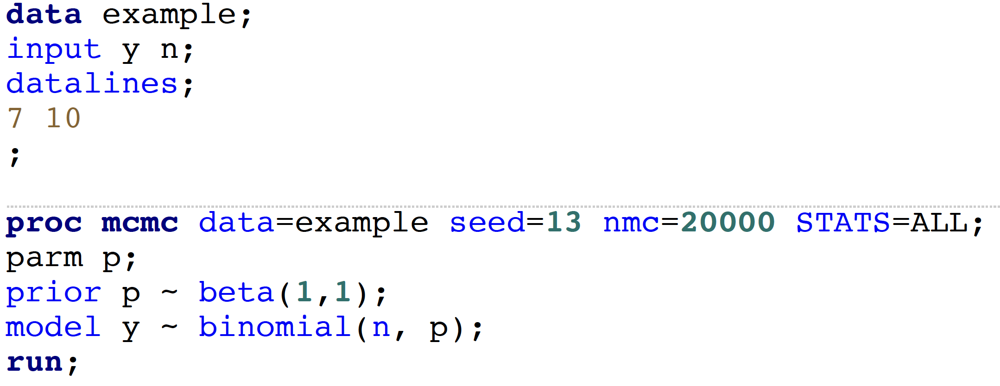
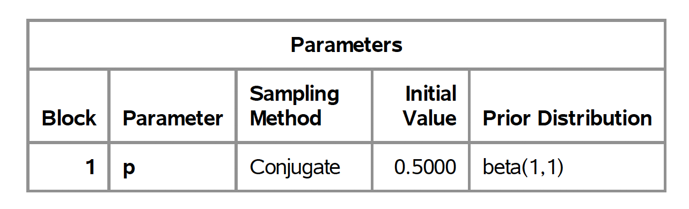
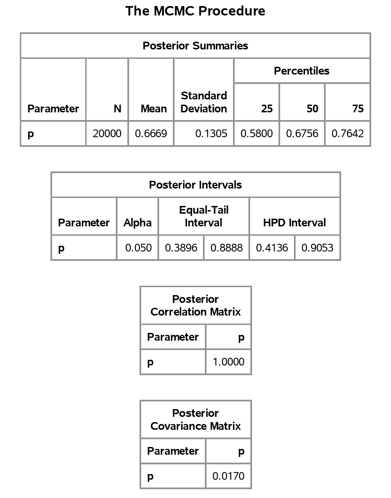
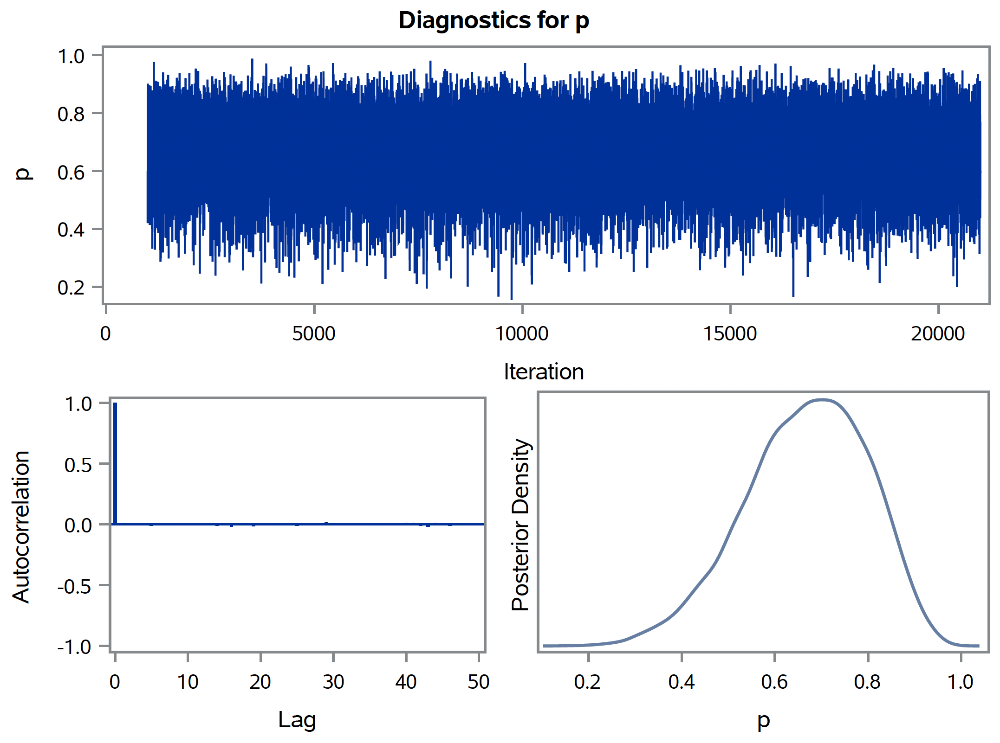

```{r setup, include=FALSE}
knitr::opts_chunk$set(echo = TRUE)
library(knitr)
library(graphics)
library(HDInterval) ## To calculate highest posterior density (HPD) interval
```

## Binomial-Beta example
Bayes' theorem: $P(\theta | y) = \frac{P(y | \theta)P(\theta)}{\sum{P(y|\theta)P(\theta)}}$

Likelihood: $P(y | \pi) {\sim} Bin(n, \pi)$

Prior: $P(\pi) {\sim} Beta(\alpha, \beta)$

Posterior: $P(\pi | y) {\sim} Beta(y+\alpha, n-y+\beta)$

Beta Distribution:

$X {\sim} Beta(\alpha, \beta), x \in [0, 1]$ 

$f(x) = \frac{\Gamma(\alpha + \beta)}{\Gamma(\alpha)\Gamma(\beta)}x^{(\alpha-1)}(1-x)^{\beta-1}$ 

$E(X) = \frac{\alpha}{\alpha + \beta}$ 

$Mode = \frac{\alpha-1}{\alpha+\beta-2} \mbox{ for } \alpha, \beta > 1$ 

$Variance = \frac{\alpha\beta}{(\alpha + \beta)^2 (\alpha + \beta + 1)}$ 

\textbf{Example} 7 successes out of 10 trials. No prior information about $\pi$.

Prior: $P(\pi) {\sim} Beta(1, 1) \equiv Unif(0, 1)$

Posterior: $P(\pi | y) {\sim} Beta(8, 4)$

MLE: $\frac{7}{10}$

Posterior mean: $E(\pi | y)=\frac{8}{8+4}$

Posterior mode: $\frac{7}{10}$

Calculate 95\% credible interval
```{r}
qbeta(p=c(0.025, 1-0.025), shape1=8, shape2=4)  
```

Let's compare MLE and posterior distribution of $\pi$ at different data points. We observe that posterior means show shrinkage towards 0.5 as compared to MLE. Note that prior mean of $\pi$ is 0.5.  
```{r}
temp <- cbind( (0:10), (0:10)/10, (1+(0:10))/(12))
colnames(temp) <- c("Data", "MLE", "Posterior Mean")
temp
```


Let's draw $\theta$ step by step. 
```{r}
theta <- seq(0, 1, by=0.00001) ## A grid of theta (collection of theta)
theta.prior <- 1/length(theta)  ## Uniform distribution, P(theta)
lik <- dbinom(x=7, size=10, prob=theta)  ## Likelihood at each theta value P(Y|theta)
lik.theta.prior <- lik*theta.prior       ## P(Y|theta)P(theta)
theta.post <- lik.theta.prior/sum(lik.theta.prior)  ## P(Y|theta)P(theta) / sum[P(Y|theta)P(theta)]
theta.post.sample <- rbeta(100000, shape1=8, shape2=4)  ## theta sample from posterior distribution

out.tab <- cbind(theta=theta, theta.prior=theta.prior, lik=lik, 
                 lik.theta.prior=lik.theta.prior, theta.post=theta.post)
head(out.tab)
out <- list(mean.prior=sum(theta*theta.prior),
            mean.post=sum(theta*theta.post),
            Equal.tail.interval1=
              c(max(theta[cumsum(theta.post)<=0.05/2]), min(theta[cumsum(theta.post)>1-0.05/2])),
            Equal.tail.interval2=
              c(quantile(theta.post.sample, probs=0.025), quantile(theta.post.sample, probs=0.975)),
            HDI=hdi(theta.post.sample, credMass=0.95)
            )
out
```

\newpage
```{r}
plot(x=theta, y=theta.post, type="l", lwd=1,
     xlab=expression(theta), ylab="Density",
     main="Posterior distribution of theta, Beta(8,4)")
#lines(density(theta.post.sample), col=2)
abline(v=8/12)
abline(v=7/10, lty=2)
abline(v=out$Equal.tail.interval1, lty=3)
abline(v=out$HDI, lty=4)

legend("topleft", c("Posterior mean", "MLE", "Equal-tail inverval", "HDI"), lty=c(1,2,3,4))
```

\newpage
Now, check SAS code and outputs.

{width=70%} 

{width=60%} 

{width=60%} 

{width=80%}


